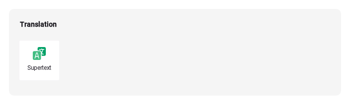
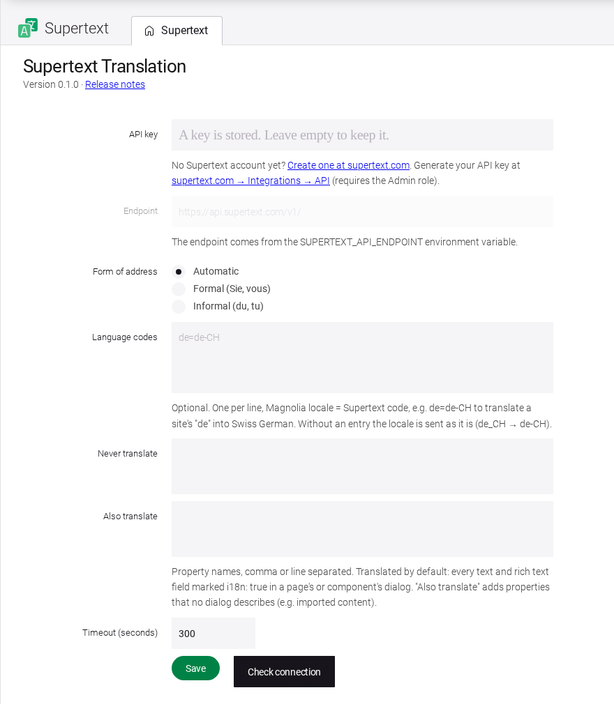
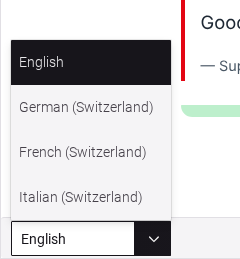

# Installation guide — Supertext Translation for Magnolia

For administrators who install and configure the module.

## Requirements

- Magnolia **6.4** (tested with 6.4.10 Community Edition; DX Core works the same way), which runs on Java 17 or 21 and a Jakarta servlet container such as Tomcat 11.
- The standard modules *Pages app* (`pages-app`) and *Site* (`site`). Every Magnolia bundle has them.
- A site with more than one language (see [Language setup](#language-setup)).
- A Supertext account with an API key for AI translation (see [API key](#api-key)).
- The Magnolia server must reach `https://api.supertext.com` over HTTPS.

## Install

The module is a single jar, `magnolia-supertext-translation-X.Y.Z.jar`, attached to every [GitHub release](https://github.com/Supertext/Magnolia-Supertext-Translation/releases). It needs no other libraries (everything it uses ships with Magnolia).

**Maven webapp project** (the usual Magnolia setup): install the jar into your Maven repository and add it to the webapp's `pom.xml`:

```bash
mvn install:install-file -Dfile=magnolia-supertext-translation-0.1.0.jar \
  -DgroupId=com.supertext -DartifactId=magnolia-supertext-translation -Dversion=0.1.0 -Dpackaging=jar
```

```xml
<dependency>
  <groupId>com.supertext</groupId>
  <artifactId>magnolia-supertext-translation</artifactId>
  <version>0.1.0</version>
</dependency>
```

(Or build it from this repository with `mvn install`, which puts the same artifact into your local Maven repository.)

**Existing installation without a build:** copy the jar into the webapp's `WEB-INF/lib` folder (author instance; public instances don't need it).

Restart Magnolia. It installs the module like any other: automatically when `magnolia.update.auto=true`, otherwise open AdminCentral and confirm the installation screen. The log shows `Initializing module supertext-translation`.

After the installation:

- the Pages app has a **Translate with Supertext** action (page list and page editor);
- the app launcher has a **Supertext** app in the **Translation** group (superusers only).



## Update

Replace the jar (or raise the version in your `pom.xml`) and restart. Settings and translations are kept.

## Uninstall

Remove the jar (or the dependency) and restart. Translations stay in the pages. The settings stay in the configuration (`config:/modules/supertext-translation`); delete that node in the *Configuration* app if you want them gone.

## API key

Open the app launcher → **Translation** → **Supertext** (requires the `superuser` role).

Get a key first:

- No Supertext account yet? [Log in or create a Supertext account](https://www.supertext.com/person/en/account/signin) with your e-mail address.
- Generate the AI API key at [supertext.com → Integrations → API](https://www.supertext.com/en/integrations/api). This requires the **Admin** role in your Supertext account.

The Supertext app shows both links below the API key field.

1. Paste the API key. A key copied with its `Supertext-Auth-Key` prefix works too.
2. Click **Save**, then **Check connection**. The app checks the key with Supertext (free of charge) and shows *Connected to … The API key works.* or the reason it failed.



The top of the app shows the installed **version**, linked to its release notes on GitHub; quote it when you contact support.

The key is stored in Magnolia's configuration (`config:/modules/supertext-translation/config`, property `apiKey`), which only superusers can read by default. It is never shown again: leave the field empty to keep it. For production, prefer the environment variable, which keeps the key out of the repository and its backups.

**Environment variables win** over the app (useful for containers). Java system properties with the same names work too.

| Variable | Meaning |
| --- | --- |
| `SUPERTEXT_API_KEY` | API key. The app then shows that the key comes from the environment and disables the field. |
| `SUPERTEXT_API_ENDPOINT` | API endpoint, default `https://api.supertext.com/v1/`. The endpoint field is then disabled. |

## Language setup

Translations go from the site's **default language** into its other languages. Magnolia keeps every language of a page in the page itself: the default language under the field's name (`title`), the others with the locale appended (`title_de_CH`). The languages come from the site definition's `i18n` section, the same configuration the page editor's language selector uses:

```yaml
# <your-light-module>/sites/<site>.yaml (or the site definition in config:/modules/site/config/site)
i18n:
  class: info.magnolia.cms.i18n.DefaultI18nContentSupport
  enabled: true
  fallbackLocale: en        # the default (source) language
  locales:
    en:
      language: en
      enabled: true
    de_CH:
      language: de
      country: CH
      enabled: true
    fr_CH:
      language: fr
      country: CH
      enabled: true
```



Fields are translated when the page's or component's dialog marks them `i18n: true`, as Magnolia's multilingual authoring requires anyway:

```yaml
form:
  properties:
    title:
      $type: textField
      i18n: true
    text:
      $type: richTextField
      i18n: true
```

The locale is sent to Supertext as the target language (`de_CH` → `de-CH`, `fr` → `fr`), and the default language as its language part (`en_US` → `en`). If Supertext needs a different code, map it under **Language codes** (see below).

### Interface languages

The module's own screens (the *Translate with Supertext* action and dialog, its messages and the Supertext app) are available in English, German, French and Italian. They follow each user's AdminCentral language: the user menu (top right) → **Edit profile** → **Language**, or for other users the Security app → **Users** → edit the user → **Language**. Other interface languages fall back to English. This is independent of the site's content languages above.

## Permissions

| Who | Can |
| --- | --- |
| Anyone who may edit the page (write permission on the `website` workspace, e.g. the `pages-app-editor` role) | Use **Translate with Supertext**. Translations are written with the editor's own rights, so Magnolia's access control applies. Magnolia has no per-language permissions: an editor of a page can translate it into every language of its site. |
| `superuser` | Open the Supertext app. To open it to other roles, decorate `supertext-translation:apps/supertext.yaml` (`permissions: roles`). |

## All settings

| Setting | Default | Meaning |
| --- | --- | --- |
| API key | – | See above. |
| Endpoint | `https://api.supertext.com/v1/` | Change only for testing. Must be `https` (plain `http` only to `localhost`), because the API key travels with every request. Disabled while `SUPERTEXT_API_ENDPOINT` is set. |
| Form of address | Automatic | *Formal* or *Informal* for languages that distinguish them (German *Sie*/*du*, French *vous*/*tu* …). |
| Language codes | – | One `locale=code` per line, e.g. `de=de-CH` if your site uses `de` but you want Swiss German. A line matches the locale (`de_CH` or `de-CH`) or its language (`de`). |
| Never translate | – | Property names (comma or line separated) that keep the source text, e.g. `teaserCode`. |
| Also translate | – | Property names that are translated wherever they hold text, even if no dialog describes them (content from imports or legacy Magnolia 5 dialogs). Rich text is recognised by its tags. |
| Timeout (seconds) | 300 | How long to wait for Supertext per document before giving up (10–3600 s). |

## Troubleshooting

| Message or problem | What to do |
| --- | --- |
| *No Supertext API key configured* | Add the key in the Supertext app, or set `SUPERTEXT_API_KEY`. No account yet? Create one at [supertext.com](https://www.supertext.com/person/en/account/signin). Generate the key at [supertext.com → Integrations → API](https://www.supertext.com/en/integrations/api) (Admin role). |
| *Authentication failed. Please check the Supertext API key.* | The key is wrong or revoked. Paste it again, or generate a new one at [supertext.com → Integrations → API](https://www.supertext.com/en/integrations/api). |
| *This site has only one language* | Add languages to the site's `i18n` configuration (see Language setup). |
| *Too many requests to Supertext* | The module already retries rate limits 4 times; try again in a minute. |
| *Timed out waiting for the Supertext translation* | Very long pages (or with subpages): raise the timeout. |
| *Your Supertext translation limit is exceeded* | Contact Supertext about your plan. |
| *Could not reach Supertext* | The server can't connect to `api.supertext.com` (firewall, proxy). Magnolia uses the JVM's proxy settings (`https.proxyHost`, `https.proxyPort`). |
| No *Translate with Supertext* action | The user can't edit the page, the page is marked for deletion, or the module isn't installed (check the log). |
| A field stays in the source language | Its dialog doesn't mark it `i18n: true`, it's excluded under *Never translate*, or it's a field type that isn't translated (see the user guide). Add it under *Also translate* if it holds text. |

The module logs under `com.supertext.magnolia.translation` (warnings by default; Magnolia's default `log4j2.xml` sets `com` to `WARN`).
