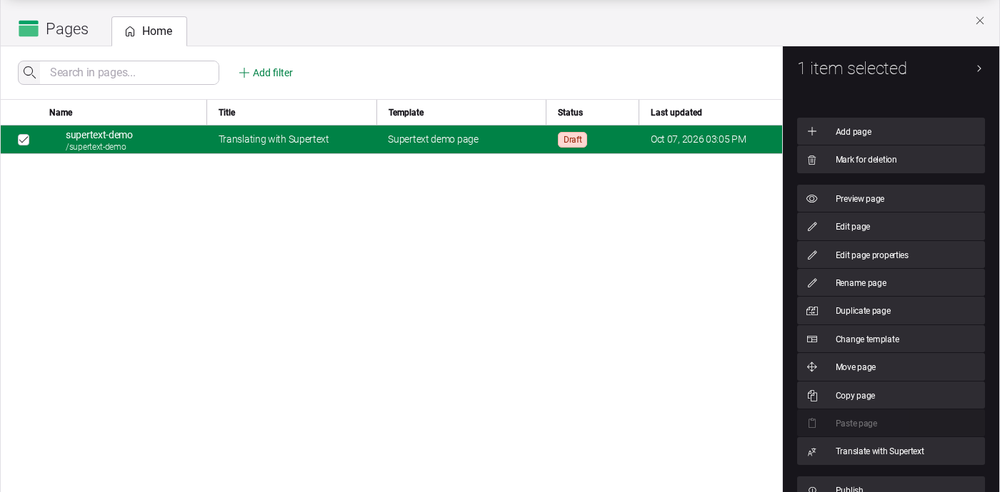
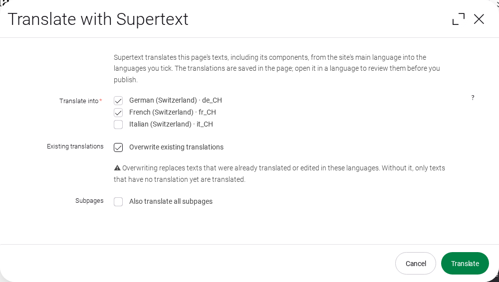
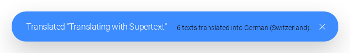
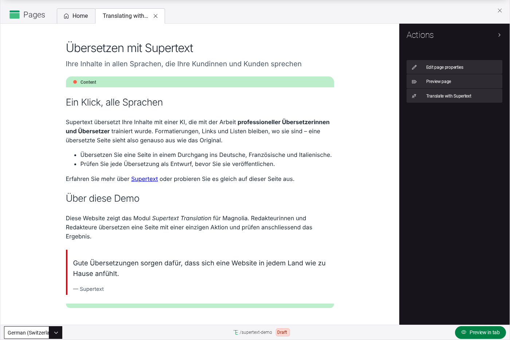
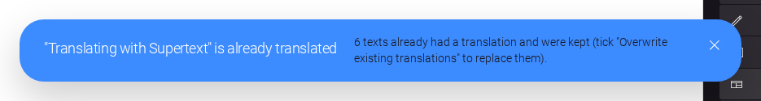

# User guide — Supertext Translation for Magnolia

For editors who translate pages. Your site has one main language (for example English) and some other languages (for example German, French and Italian). In Magnolia, all languages of a page live in the same page: the page editor's language selector switches between them.

## Translate a page

1. Open the **Pages** app and select the page. Click **Translate with Supertext** in the action bar (below *Paste page*). In the page editor, the same action is next to *Edit page properties* when the page itself is selected.

   

2. Tick the languages you want. Leave **Overwrite existing translations** unticked to translate only what has no translation yet, and tick **Also translate all subpages** to include the pages below it. Click **Translate**.

   

3. Supertext translates the page's title and texts and those of all its components, one language after the other. A message tells you how many texts were translated.

   

The translations are saved in the page right away, as for any change in Magnolia: the page shows as modified, and nothing changes on the public site until you publish.

## Review and publish

Open the page in the page editor and pick the language in the **language selector** at the bottom left. Check the texts and correct what you like in the usual dialogs (they show the language you picked). Then publish the page as usual.

## Translate again

Without **Overwrite existing translations**, texts that already have a translation in that language are kept, including your corrections; only texts without a translation (for example a new component) are translated. The message says how many were kept:

With **Overwrite existing translations**, every text is translated again from the main language and **replaces** what is in that language now, including changes you made by hand. The dialog warns about this below the checkbox.

## What is translated

- Every text and rich text field of the page and its components that is set up as multilingual (`i18n`) in its dialog: titles, introductions, headlines, body texts, quotes, teasers …
- Fields inside composite fields (groups of fields), if they are multilingual.
- With **Also translate all subpages**: the same for every page below.

Formatting, links and lists in rich text stay where they are; links keep their target, only the link text is translated.

**Not translated:** fields that aren't multilingual (they look the same in every language, like the quote's author in the demo), links, images and assets, dates, choices, tags and categories, the texts of assets in the Assets app, and fields your administrator excluded.

## Messages

The dialog, the messages and the Supertext app follow your AdminCentral interface language (English, German, French or Italian), which you set in your user profile.

| Message | Meaning |
| --- | --- |
| *6 texts translated into German (Switzerland).* | Done. Review and publish. |
| *… texts already had a translation and were kept* | Those texts were translated before (or edited). Tick *Overwrite existing translations* to replace them. |
| *… texts came back unusable and were left unchanged* | Supertext returned those texts damaged or empty; they keep what they had. Try again, or translate them by hand. |
| *Nothing to translate* | The page has no texts in the main language (or none that are multilingual). |
| *Italian (Switzerland): …* (in a message titled *with problems*) | That language failed; the others were saved. The reason follows, e.g. *Too many requests* (try again in a minute). |
| *No Supertext API key configured* / *Authentication failed* | Ask your administrator to check the Supertext app. The dialog stays open; nothing was changed. |
| *Translate into* is marked red | Pick at least one language. |
